# WiFi Setup Using LittlevGL

## Overview

This application is designed to be a template for a device that needs the WiFi configured before the main functionality is available.
It provides the ability to configure the device to connect to an existing WiFi network. The hardware used is an ESP32 device with
a TFT screen connected. This is similar to the Huzzah featherwing device. A schematic of the hardware is included below.

## WiFi Setup GUI

Therefore if no station WiFi SSID is configured the user is guided through a Wizard style interface to configure the GUI.
This interface presents the following screens
* Enter the WiFi SSID.  
    The user may enter the WiFi SSID via an on screen keyboard (this pops up if the user presses on the WiFi SSID text area).
    Alternatively the user may press the Scan button to scan for available WiFi networks. Once the scan is complete the required 
    network can be selected from an on screen pulldown list. Once the WiFi SSID has been entered the user can press the Next button  
    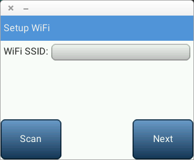 | 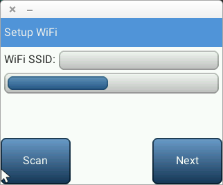 | 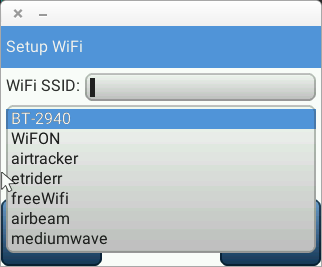 | 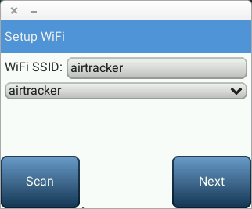  
* Enter the WiFi password.  
    The user may enter the WiFi password via an on screen keyboard. As each key is pressed the character entered appears in the 
    WiFi password text area and shortly after this character is replaced by the * character to hide the password.
    The user may select the Next button to proceed or the back button to move to the above step.  
    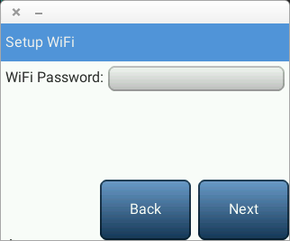 | 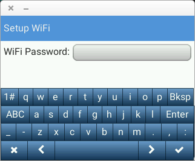 | 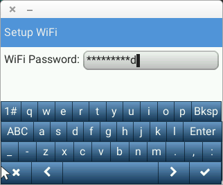 | 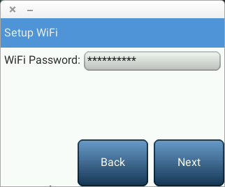  
* Review configuration.  
    This screen displays the WiFi SSID and password just entered. The password is initially masked out (replaced with * characters).
    If the user selects the Show Password button the password is displayed.  
    The user may select the Finish button to configure the WiFi or the back button to move to the above step.
    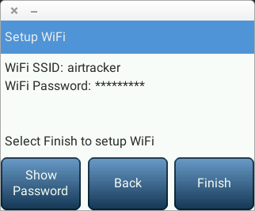 | 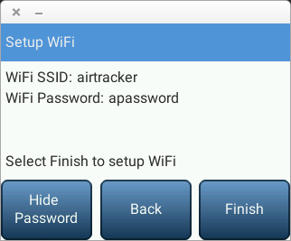

### GUI APP
When a WiFi SSID has been configured then the user is presented with a screen that contains a button to load the factory default configuration.  

This is a starting point for you to implement the GUI for your application.  
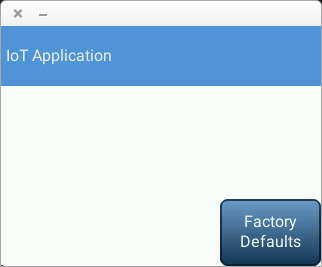

### Demo Board Schematic

### Display Hardware
The display used is shown below

  
[Display details](http://www.lcdwiki.com/2.8inch_SPI_Module_ILI9341_SKU:MSP2807)

